# Leaflet.MarkerCluster.PlacementStrategies

**subplugin for the [Leaflet.MarkerCluster](https://github.com/Leaflet/Leaflet.markercluster) that implements new possibilities how to place clustered chidren markers**

## Demo:

[random data demo](https://adammertel.github.io/Leaflet.MarkerCluster.PlacementStrategies/demo/random-data.html)

## How to use:

1. include Leaflet and Leaflet.MarkerCluster libraries (cdnjs, ungkg, ...) or npm install these libraries with `npm install leaflet leaflet.markercluster`

2. download and include built [leaflet-markercluster.placementstrategies.js](https://github.com/adammertel/Leaflet.MarkerCluster.PlacementStrategies/blob/master/dist/leaflet-markercluster.placementstrategies.js) or [leaflet-markercluster.placementstrategies.src.js](https://github.com/adammertel/Leaflet.MarkerCluster.PlacementStrategies/blob/master/dist/leaflet-markercluster.placementstrategies.src.js) file from dist folder or npm install `npm install leaflet.markercluster.placementstrategies`

3. create L.markerClusterGroup instance, add markers, and define placement strategy and other options. We recommend to hide spiderLegs by `spiderLegPolylineOptions: {weight: 0}`

```js
var markers = L.markerClusterGroup({
  spiderLegPolylineOptions: { weight: 0 },
  clockHelpingCircleOptions: {
    weight: 0.7,
    opacity: 1,
    color: "black",
    fillOpacity: 0,
    dashArray: "10 5",
  },

  elementsPlacementStrategy: "clock",
  helpingCircles: true,

  spiderfyDistanceSurplus: 25,
  spiderfyDistanceMultiplier: 1,

  elementsMultiplier: 1.4,
  firstCircleElements: 8,
});

for (var i = 0; i < 10000; i++) {
  var circle = L.circleMarker([Math.random() * 30, Math.random() * 30], {
    fillOpacity: 0.7,
    radius: 8,
    fillColor: "red",
    color: "black",
  });
  markers.addLayer(circle);
}

map.addLayer(markers);
```

### React-leaflet

This sub-plugin can be easily used also with react-leaflet.

1. Install leaflet, react-leaflet, leaflet.markercluster, react-leaflet-markercluster
   `npm install leaflet react-leaflet leaflet.markercluster react-leaflet-markercluster`
2. Install leaflet.markercluster.placementstrategies
   `npm install leaflet.markercluster.placementstrategies`
3. Import libraries and create component

```tsx
import L from "leaflet";

import {
  Map,
  Marker,
  TileLayer,
  LayersControl,
  LayerGroup,
} from "react-leaflet";

import MarkerClusterGroup from "react-leaflet-markercluster";
import "leaflet.markercluster.placementstrategies";

import "./../node_modules/leaflet/dist/leaflet.css";

export const MapComponent: React.FC = ({ center, zoom, points }) => {
  return (
    <Map center={center} zoom={zoom}>
      <LayersControl position="bottomright">
        <LayersControl.BaseLayer name="Open Street Maps">
          <TileLayer
            attribution="&copy; <a href='https://www.openstreetmap.org/copyright'>OpenStreetMap</a> contributors"
            url="https://{s}.tile.openstreetmap.fr/hot/{z}/{x}/{y}.png"
          />
        </LayersControl.BaseLayer>
      </LayersControl>
      <LayerGroup>
        <MarkerClusterGroup
          showCoverageOnHover={false}
          spiderLegPolylineOptions={{ weight: 0 }}
          clockHelpingCircleOptions={{
            weight: 0.7,
            opacity: 1,
            color: "black",
            fillOpacity: 0,
            dashArray: "10 5",
          }}
          elementsPlacementStrategy="clock-concentric"
          helpingCircles={true}
          maxClusterRadius={25}
          iconCreateFunction={(cluster) => {
            return divIcon({
              html: `<div class="outer"><div class="inner"><span class="label">${cluster.getChildCount()}</span></div></div>`,
              className: "marker-cluster",
              iconSize: [20, 20],
            });
          }}
        >
          {points.map((point, ii) => {
            return (
              <Marker key={ii} position={point.coords}>
                <Popup>
                  <div className="tooltip-content">{point.info}</div>
                </Popup>
              </Marker>
            );
          })}
        </MarkerClusterGroup>
      </LayerGroup>
    </Map>
  );
};
```

## How to build:

1. install npm modules `npm install`
2. run build command `npm run build`

`npm start` watches changes in js files and builds

## Placement Strategies

- **default** - one-circle strategy (up to 8 elements\*, else spiral strategy)
- **spiral** - snail/spiral placement

  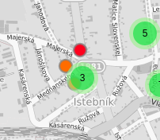
  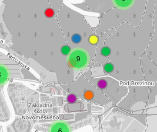
  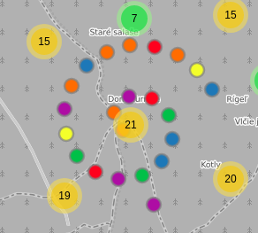

- **one-circle** - put all the elements into one circle

  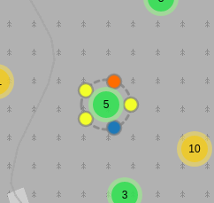
  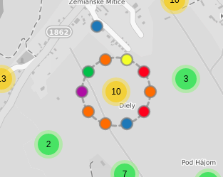
  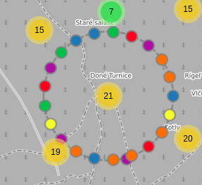

- **concentric** - elements are placed automatically into concentric circles, there is a maximum of 4 circles

  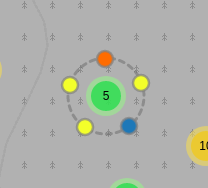
  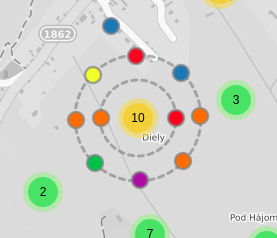
  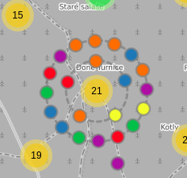

- **clock** - fills circles around the cluster marker in the style of clocks

  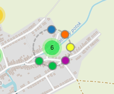
  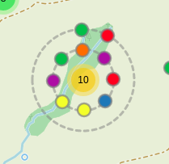
  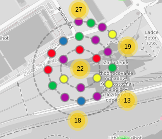

- **clock-concentric** - in the case of one circle, elements are places based on the concentric style, more circles are dislocated in the clock style

  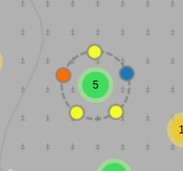
  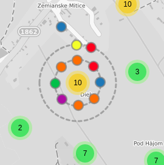
  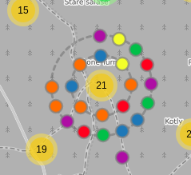

- **original-locations** - elements are placed at their original locations

  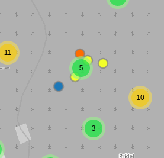
  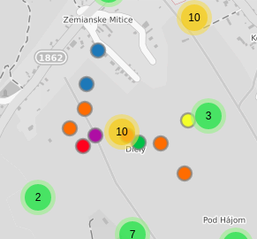
  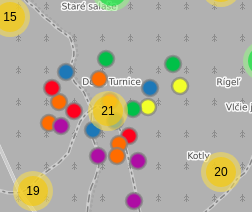

\*_can be changed - \_circleSpiralSwitchover variable in the original markerCluster code_

## Helping Circles

the new type geometry called "helpingCircle" to make the cluster more visually-consistent (not supported for **origin-locations** strategy and **spiral** strategy)

## Options

- **elementsPlacementStrategy** (default value 'clock-concentric') - defines the strategy for placing markers in cluster, see above
- **spiderfiedClassName** (default value false) - a classname value for spiderfied markers, usefull for styling...

### Options that are valid for placement strategies 'concentric', 'clock' and 'clock-concentric'

- **firstCircleElements** (default value **10**) - the number of elements in the first circle
- **elementsMultiplier** (default value **1.5**) - the multiplicator of elements number for the next circle
- **spiderfyDistanceSurplus** (default value **30**) - the value to be added to each new circle distance value
- **helpingCircles** (default value **true**) - switch drawing helping circles on
- **helpingCircleOptions** (default value **{ fillOpacity: 0, color: 'grey', weight: 0.6 }** ) - the style object for helpingCircle element

## Notes:

- this subplugin was not tested with the animations turned on (`animation` and `animateAddingMarkers` variables)
- `circleMarkers` should be preferred to markers
- use with `L.SVG` renderer if possible (`L.Canvas` renderer has technical issues with some visual properties, see [#6](https://github.com/adammertel/Leaflet.MarkerCluster.PlacementStrategies/issues/6))
